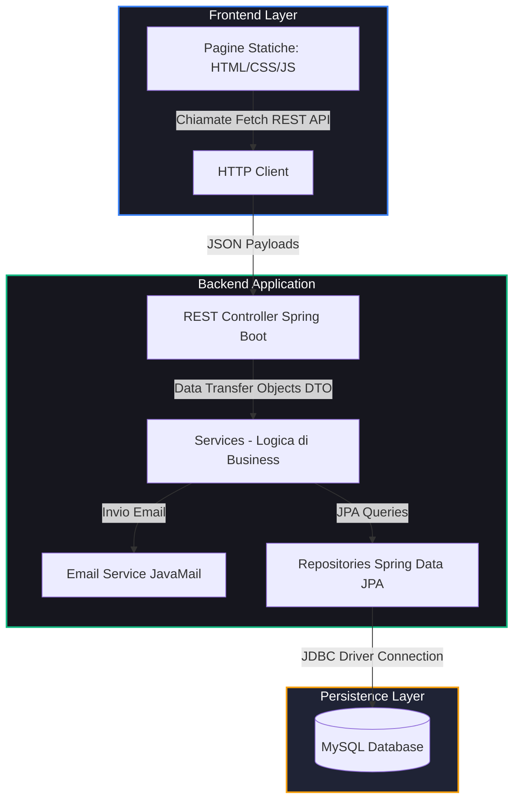
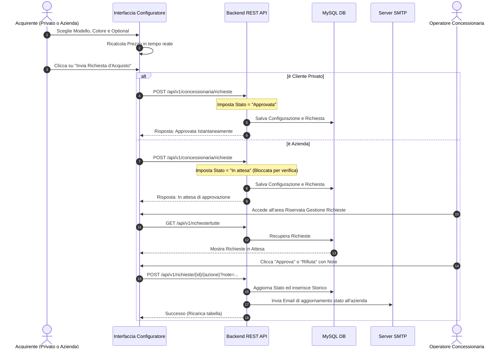

# 🚗 Concessionaria Auto - Piattaforma Gestione Concessionaria Auto 

🚀 **[Clicca qui per usare la Web App Live] (https://concessionaria-auto.onrender.com)** 


Questa applicazione web completa per la gestione e configurazione auto unisce un solido backend **Spring Boot** con un database relazionale **MySQL** e un'interfaccia frontend reattiva sviluppata in **Vanilla Javascript** e **Bootstrap 5**, caratterizzata da un'estetica moderna in stile **Dark Glassmorphism** (tema scuro con sfocature a specchio e pulsanti neon/glow).

---

## 🏗️ Architettura del Sistema

L'applicazione segue i pattern architetturali standard di Spring Boot (REST Controller -> Service -> Repository -> JPA Entities), interfacciandosi con un frontend a singola pagina statico.



---

## 🔄 Regole e Flussi di Business

Il sistema integra logiche di convalida e flussi decisionali automatici a seconda del tipo di acquirente:



---

## 🛠️ Come Compilare e Avviare il Progetto

Segui questi passaggi per configurare, compilare ed eseguire l'applicazione sulla tua macchina locale.

### 1. Prerequisiti
* **Java Development Kit (JDK) 17** o superiore installato.
* **MySQL Server** installato e in esecuzione.
* **Maven** (incluso nel progetto tramite il wrapper `mvnw`).

### 2. Configurazione Database
Accedi al client MySQL (es. Workbench o CLI) e crea lo schema del database:
```sql
CREATE DATABASE gestione_concessionaria;
```

### 3. Configurazione delle Variabili di Ambiente (Sicurezza)
Per evitare il caricamento di credenziali in chiaro su repository pubblici, le password sensibili del database e del servizio email sono state privatizzate. 
Puoi impostare le seguenti variabili di ambiente sul tuo sistema operativo prima dell'avvio:

* `DB_PASSWORD`: La password del tuo database MySQL locale (default di fallback: `Davi2006s!`).
* `SMTP_PASSWORD`: Password per l'account SMTP Gmail (default di fallback: `jvbj cpsq bzxv tdgg`).

> [!TIP]
> Se non imposti le variabili di ambiente, il sistema utilizzerà automaticamente le password di default locali come fallback, garantendo l'avvio immediato senza configurazioni manuali.

### 4. Compilazione del Progetto
Apri il terminale nella directory principale del progetto ed esegui il comando corrispondente al tuo sistema operativo:

* **Su Windows (PowerShell / Command Prompt)**:
  ```powershell
  .\mvnw.cmd clean compile
  ```
* **Su Linux / macOS**:
  ```bash
  chmod +x mvnw
  ./mvnw clean compile
  ```

### 5. Avvio del Server
Una volta completata la compilazione senza errori, avvia l'applicazione Spring Boot:

* **Su Windows**:
  ```powershell
  .\mvnw.cmd spring-boot:run
  ```
* **Su Linux / macOS**:
  ```bash
  ./mvnw spring-boot:run
  ```

L'applicazione sarà accessibile all'indirizzo: **`http://localhost:8080/index.html`**

*(All'avvio, se la tabella degli operatori è vuota, verrà creato automaticamente un operatore amministratore con username `admin` e password `admin123`).*

### 6. Creazione del pacchetto di distribuzione (Build JAR)
Se vuoi generare il file eseguibile `.jar` autonomo distribuibile:

* **Su Windows**:
  ```powershell
  .\mvnw.cmd clean package
  ```
* **Su Linux / macOS**:
  ```bash
  ./mvnw clean package
  ```

Il file JAR compilato verrà salvato nella cartella `target/` e può essere avviato con:
```bash
java -jar target/demo-0.0.1-SNAPSHOT.jar
```

---

## 📂 Struttura del Codice Sorgente

### Frontend (`src/main/resources/static/`)
* **[index.html](./src/main/resources/static/index.html)**: Homepage di benvenuto del portale, con navigazione reattiva e riconoscimento sessione utente.
* **[Login.html](./src/main/resources/static/Login.html)**: Schermata di autenticazione e registrazione per Clienti Privati e Aziende con switch fluidi.
* **[Configuratore.html](./src/main/resources/static/Configuratore.html)**: Pannello interattivo per la scelta del modello, colore e optional con calcolo dinamico del preventivo.
* **[Admin.html](./src/main/resources/static/Admin.html)**: Cruscotto amministrativo per il monitoraggio e la modifica dello stato delle richieste d'acquisto.

### Backend (`src/main/java/com/example/demo/`)
* **`/controller`**: Endpoint HTTP JSON per autenticazione (`AuthController`), configuratore (`ConcessionariaController`) e amministrazione (`RichiestaAdminConController`).
* **`/service`**: Servizi core per la gestione della logica di business e convalide transazionali (`AuthService`, `ConcessionariaService`, `EmailService`).
* **`/model`**: Classi entità JPA mappate su tabelle MySQL (`Cliente`, `Azienda`, `Operatore`, `RichiestaAcquisto`, `StoricoRichiesta`).
* **`/repository`**: Interfacce di persistenza Spring Data JPA (`ClienteRepository`, `AziendaRepository`, etc.).
* **`/dto`**: Oggetti di trasferimento dati strutturati per l'I/O dei controller REST.
